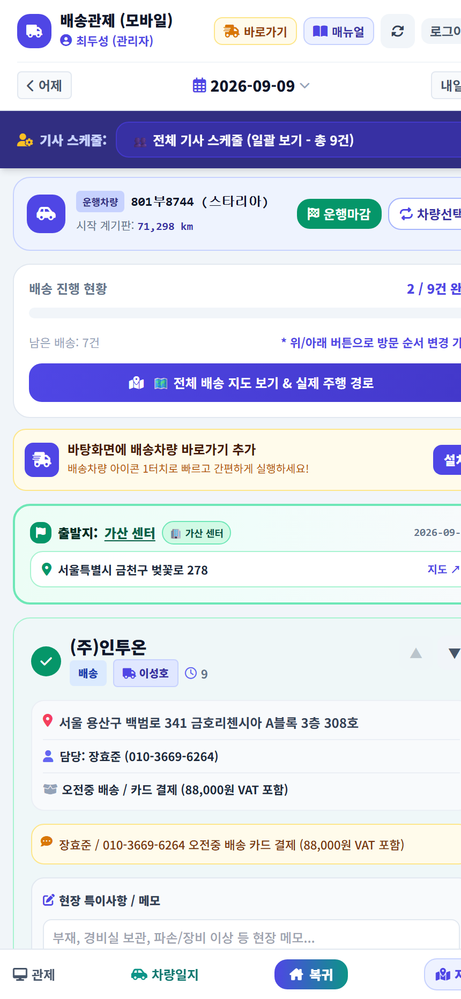
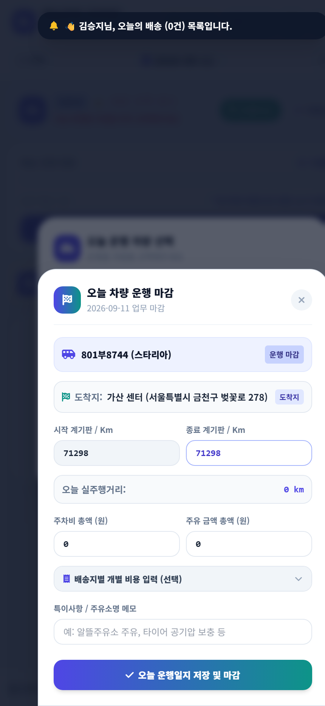
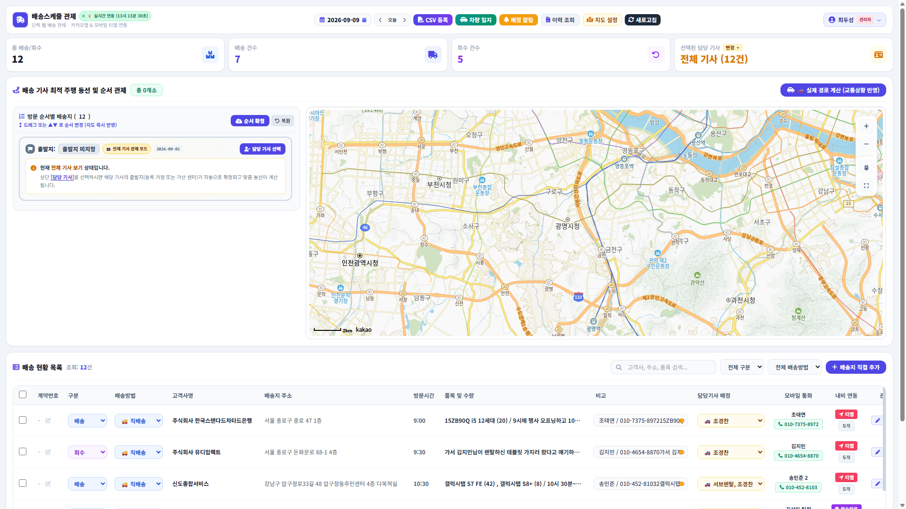
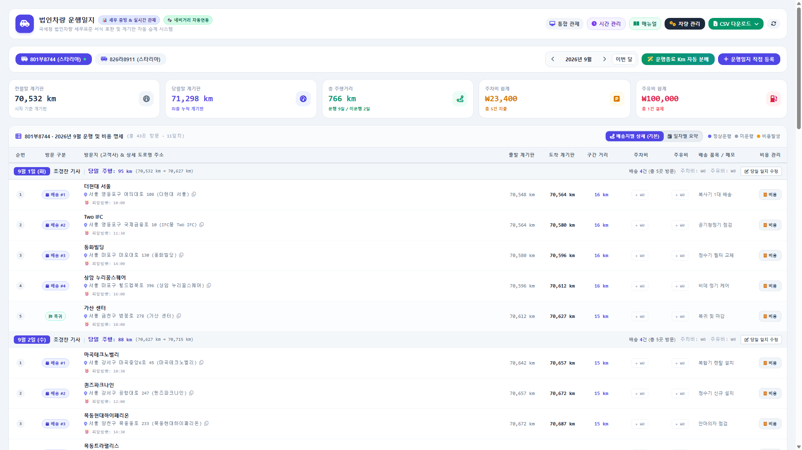

# 📘 현대렌탈 배송관제 & 법인차량 운행일지 통합 실무 매뉴얼 (v2.7 현업표준)

본 매뉴얼은 현대렌탈의 **기사 모바일웹 (`mobile.html`)**, **PC 통합 관제 대시보드 (`index.html`)**, **법인차량 운행일지 (`vehicle_log_tracker.html`)**의 실무 운영 표준 지침서입니다.

---

## 📑 목차
1. [1. 배송기사 스마트폰 모바일웹 실무 가이드](#1-배송기사-스마트폰-모바일웹-실무-가이드)
   - 1.1 스마트폰 바탕화면 앱(PWA) 추가 (1터치 실행)
   - 1.2 ★ 기사 하루 배송업무 전체 프로세스 & 1분 운행마감 (상세 화면 예시)
     - ① 출근 및 법인차량 선택 (취소 토글)
     - ② 배송 순서 및 전체 지도 동선 확인 (▲/▼ 버튼)
     - ③ 배송지 출발 (★ 티맵 안내 원클릭 - 필독 준수사항)
     - ④ 현장 도착: [배송지 도착] 완료 & 사진/메모 기록
     - ⑤ 센터 복귀 후 [운행마감] 3단계 세부 예시 (종료Km, 비용, 마감완료)
2. [2. PC 관제 대시보드 업무 프로세스 (관리자)](#2-pc-관제-대시보드-업무-프로세스-관리자)
   - 2.1 관제 대시보드 실제 화면 & 상단 주요 메뉴 번호 안내
   - 2.2 관리자 당일 배송관제 6단계 업무 진행 순서 (SOP)
     - Step 1: 아침 CSV 등록 & 시간 보존 병합
     - Step 2: 기사별 배정 & 거점(출발지) 확인 & **[순서 확정] (★필수!)**
     - Step 3: 배송 방식 분기 관제 (⚡ 퀵 배송 & 🏢 방문수령)
     - Step 4: 카카오 도로 경로 계산 & 드래그앤드롭 최적화
     - Step 5: 기사 배정 알림 전송 (카카오톡/SMS)
     - Step 6: 실시간 관제 & 배송 스케줄 시간 관리 모니터링
3. [3. 법인차량 운행일지 시스템 & 1·2팀 차량 공유](#3-법인차량-운행일지-시스템--12팀-차량-공유)
   - 3.1 일반 직배송과 운행일지 실시간 연동 원리
   - 3.2 법인차량 운행일지 실제 화면 & 핵심 기능 가이드
     - ① 배송지 및 경유지 직접 추가 (`[+ 1팀 업무]`, `[+ 주유소]`, `[+ 일반 경유지]`)
     - ② 주차비 · 주유비 비용 입력 및 개별 영수증 관리 (`[+ 비용]`)
     - ③ `[운행종료 Km 자동 분배]` 스마트 엔진
     - ④ 운전자 명단 (한민혁 포함 8인) & 명단 외 인원 '기타' 직접입력
     - ⑤ 국세청 표준 CSV & 배송지별 상세 CSV 2종 다운로드
   - 3.3 1팀 / 2팀 법인차량 공유 3대 골든 룰 & 운영 프로토콜

---

## 1. 배송기사 스마트폰 모바일웹 실무 가이드

### 1.1 스마트폰 바탕화면 앱(PWA) 추가 (1터치 실행)
- 기사님이 매번 인터넷 주소를 입력할 필요 없이 스마트폰 바탕화면에 **현대렌탈 트럭 아이콘 앱**으로 설치하여 1터치로 실행합니다.
- **안드로이드**: 모바일웹 상단 노란색 `[바로가기]` 터치 ➔ [홈 화면에 추가] ➔ [설치]
- **아이폰(iOS)**: 사파리 하단 공유(네모+화살표) ➔ [홈 화면에 추가]
- **PIN 로그인**: 성명(예: `김승지`, `조경찬`)과 숫자 4자리 PIN(`1234`) 입력 후 **[자동 로그인]**을 체크해 두면 하루 종일 재로그인 없이 즉시 배송 화면으로 열립니다.

---

### 1.2 ★ 기사 하루 배송업무 전체 프로세스 & 1분 운행마감 (상세 화면 예시)

##### ① 오전 08:30 출근: 법인차량 선택 및 시작 계기판 확인
- 상단 **`[차량선택]`** 터치 ➔ 오늘 탑승할 스타리아(예: `801부8744`) 카드 선택
- 이전 운행자(1팀 또는 다른 기사)가 마감한 최종 누적 Km가 내 **시작 계기판**으로 자동 승계됩니다.
- **차량 선택 취소 (토글)**: 차량을 잘못 골랐거나 미배차로 돌릴 때는, 이미 초록색 체크가 표시된 카드를 **한 번 더 터치**하거나 하단의 `[선택 취소 (미운행)]`을 누르면 즉시 해제됩니다.

<p align="center">
  
</p>

#### ② 출발 전 점검: 배송 순서 및 전체 지도 동선 확인
- 나에게 배정된 배송지 목록을 확인합니다.
- 상단 **`[🗺️ 전체 배송 지도 보기 & 실제 주행 경로]`**를 터치하여 오늘 방문할 전체 경유지와 추천 도로 주행선을 확인합니다.
- 현장 상황에 맞춰 카드의 **[▲] / [▼]** 버튼으로 방문 순서를 즉시 조정할 수 있으며, 관제 PC 화면에도 동기화됩니다.

<p align="center">
  
</p>

#### ③ 배송지 출발: [티맵 안내] 원클릭 실행 (★ 기사 필독 준수사항)
> [!IMPORTANT]
> **출발 전 절대 스마트폰 티맵 앱을 따로 켜지 마세요!**
> 배송지로 출발할 때는 모바일 배송 카드 좌측 하단의 로즈레드 색상 **`[티맵 안내]`** 버튼을 터치하여 출발해야 합니다.
> - **출발 시각 자동 기록**: 버튼을 누르는 즉시 관제 대시보드와 시간 관리 시스템에 출발 시각이 초 단위로 자동 전송됩니다.
> - **내비 목적지 자동 세팅**: 고객사의 상세 도로명 주소가 티맵 내비에 자동 입력되어 즉시 길안내가 시작됩니다.

#### ④ 현장 도착: [배송지 도착] 클릭 & 사진/메모 기록
- 고객사에 도착하면 우측 하단의 **`[배송지 도착 / 도착 완료]`** 버튼을 누릅니다.
- **도착 시각 & 소요시간**: 출발부터 도착까지의 주행 시간(예: 35분 소요)이 자동 기록됩니다.
- **현장 사진 첨부**: 문 앞 배송 사진 등록 시 데이터 절약을 위해 자동 압축되어 클라우드에 영구 저장됩니다.
- **안심 전화 통화**: 초록색 전화 버튼을 누르면 오발신 방지 팝업 후 즉시 스마트폰 통화 화면으로 연결됩니다.

#### ⑤ 센터 복귀 후 [운행마감] 3단계 세부 예시 (단 1분 소요!)
모든 배송을 마치고 가산 센터로 복귀하면 상단 우측의 **`[운행마감]`** (초록색 깃발) 버튼을 누르고 아래 3단계를 순서대로 진행합니다:

<p align="center">
  
</p>

```
[1단계: 종료 계기판 입력]
  시작 계기판: 71,298 km
  종료 계기판: [ 71,365 ] km 입력
  ➔ 오늘 실주행거리: 67 km 자동 계산!

[2단계: 주차비 / 주유비 입력 (선택)]
  주차비 총액: [ 5,000 ] 원
  주유비 총액: [ 50,000 ] 원
  메모: GS칼텍스 가산주유소 주유
  (비용이 발생하지 않은 날은 0원 그대로 유지)

[3단계: [오늘 운행일지 저장 및 마감] 원클릭]
  ➔ 법인차량 운행일지 시스템으로 오늘 주행거리와 경유지 일괄 전송 완료!
```
* **현지(자택) 퇴근 시**: 센터로 복귀하지 않고 자택으로 바로 퇴근할 때는 마감 팝업의 **[도착지 변경]**을 눌러 자택 주소를 입력하고 마감하시면 해당 위치까지의 거리로 안전하게 마감됩니다.

---

## 2. PC 관제 대시보드 업무 프로세스 (관리자)

### 2.1 관제 대시보드 실제 화면 & 상단 주요 메뉴 번호 안내


- **① 배송일자 선택 캘린더**: 상단 캘린더 피커와 [오늘], [◀], [▶] 버튼으로 배송일자를 자유롭게 전환
- **② 기사 필터**: 전체 기사 보기 또는 개별 기사 선택 필터링
- **③ `[CSV 등록]` 버튼**: ERP 배송 엑셀 CSV 파일 업로드 (시간 보존 병합 엔진 탑재)
- **④ `[+ 배송지 직접 추가]` 버튼**: 당일 긴급 수기 주문 즉시 등록
- **⑤ `[순서 확정]` 버튼 (★핵심 필수)**: 좌측 배송 순서 패널 상단의 파란색 버튼으로, **기사 모바일에 순서를 확정 배포**
- **⑥ `[배정 알림]` 버튼**: 배정 완료된 일정을 기사님들의 카카오톡 알림톡/문자 메시지로 일괄 발송
- **⑦ `[이력 조회]` 버튼**: 고객 계약번호별 과거 배송/회수 내역 및 현장 기사 메모 신속 검색
- **⑧ 우측 상단 팝업 메뉴**: `📖 시스템 매뉴얼`, 배송 스케줄 시간 관리, 법인차량 운행일지 바로가기 지원

---

### 2.2 관리자 당일 배송관제 6단계 업무 진행 순서 (SOP)

1. **Step 1: 아침 배송 스케줄 CSV 등록 & '시간 보존 병합'**:
   - ERP에서 내려받은 당일 배송 CSV 파일을 상단 `[CSV 등록]` 버튼으로 업로드합니다.
   - **시간 보존 병합**: 당일 낮에 긴급 건이 추가되어 CSV를 다시 덮어씌우더라도, **기사님이 현장에서 이미 찍은 출발 시각, 도착 시각, 현장 사진, 메모는 절대로 삭제되지 않고 100% 안전하게 유지**됩니다.
2. **Step 2: 기사별 배정 & 담당 거점(출발지) 확인 & [순서 확정] (★필수!)**:
   - 메인 테이블에서 각 주문의 담당기사를 지정하고, 개별 거점에서 출발하는 기사는 우측 상단 메뉴의 [기사별 출발지/거점 관리]에서 출발지 주소를 설정합니다.
   > [!IMPORTANT]
   > **반드시 [순서 확정] 버튼을 눌러주셔야 합니다!**
   > 기사 배정 및 순서 정렬이 끝나면, 좌측 패널 상단에 있는 파란색 **`[순서 확정]`** 버튼을 꼭 클릭하십시오. 이 버튼을 눌러야 확정된 방문 순서(`stop_order`)가 클라우드 DB에 동기화되어 **기사님의 모바일 화면에 번호 순서대로 정확하게 노출**됩니다.
3. **Step 3: 배송 방식 분기 관제 (⚡ 퀵 배송 & 🏢 방문수령)**:
   - 기사가 차량으로 운전하는 일반 직배송 외에 외주 퀵과 고객 내방 건을 정확히 분기 처리합니다.
   - **⚡ 퀵 배송 처리**:
     - 오토바이 퀵 접수 시: 메인 테이블의 `[접수완료]` 클릭 ➔ 접수 시각 자동 기록.
     - 퀵 기사 픽업 출발 시: `[퀵 출발]` 클릭 ➔ 퀵 출발 시각 및 접수 후 경과시간 기록.
     - *차량 운행이 아니므로 법인차량 운행일지에서 자동 제외되어 국세청 증빙이 안전하게 보호됩니다.*
   - **🏢 방문수령 처리**:
     - 길안내 불필요: 고객이 센터로 직접 찾아오는 주문이므로 티맵 버튼이 숨겨져 있습니다.
     - 고객 방문 인도 시: 초록색 `[수령 완료]` 클릭 ➔ 수령 완료 시각 기록 및 완료 처리.
4. **Step 4: 카카오 도로 경로 계산 & 드래그앤드롭 순서 최적화**:
   - 우측 지도 상단의 `[실제 경로 계산 (교통상황 반영)]` 버튼을 누르면 실시간 도로망 기준 주행거리(km)와 예상 시간이 계산되어 지도 위에 파란색 경로 라인으로 표출됩니다.
   - 테이블 행을 마우스로 끌어다 놓거나 [▲]/[▼] 버튼으로 순서를 바꾼 뒤 **`[순서 확정]`**을 누르면 끝납니다.
5. **Step 5: 기사 배정 알림 전송 (카카오톡/SMS)**:
   - 상단의 `[배정 알림]` 버튼을 눌러 각 기사님들에게 오늘 방문할 업체 목록과 모바일웹 바로가기 링크를 카카오톡 알림톡/문자로 일괄 전송합니다.
6. **Step 6: 실시간 관제 & 배송 스케줄 시간 관리 모니터링**:
   - 기사님들이 누르는 티맵 출발 시각, 도착 완료 시각, 현장 사진이 메인 테이블에 실시간 갱신됩니다.
   - 우측 상단 메뉴 ➔ `[배송 스케줄 시간 관리]`를 열면 기사별 상세 출발/도착 타임라인 및 이동 소요 시간을 한눈에 대조 분석할 수 있습니다.

---

## 3. 법인차량 운행일지 시스템 & 1·2팀 차량 공유

### 3.1 일반 직배송과 운행일지 실시간 연동 원리
- **직배송은 차량 운행**: 기사가 모바일에서 직배송 건의 [티맵 안내]와 [도착 완료]를 누르면, 방문 업체의 도로명 주소와 도착 시각이 당일 법인차량의 **공식 경유지**로 자동 기록됩니다.
- **운행마감 결합**: 센터 복귀 후 기사가 모바일에서 [운행마감]을 누르면, 모든 경유지와 최종 계기판 Km가 결합되어 **국세청 업무용 승용차 운행기록부**로 자동 완성됩니다.

---

### 3.2 법인차량 운행일지 실제 화면 & 핵심 기능 가이드


#### ① 배송지 및 경유지 직접 추가 기능
- 기사가 모바일로 배송한 건 외에 **1팀의 업무 경유지, 주유소, 식당, 기타 거래처**가 발생했을 때 언제든 경유지를 추가할 수 있습니다.
- 우측 상단 `[+ 운행일지 직접 등록]` 또는 각 일자 우측의 `[당일 일지 수정]` 클릭
- 경유지 목록 하단의 **`[＋ 1팀 업무 경유지]`**, **`[＋ 주유소]`**, **`[＋ 일반 경유지]`** 버튼을 눌러 목적지명과 도로명 주소 입력
- 추가된 경유지는 **[▲] / [▼]** 버튼으로 원하는 방문 순서 위치로 즉시 이동 가능하며, 카카오 맵 추천 도로 거리가 자동 연동됩니다.

#### ② 주차비 · 주유비 비용 입력 및 개별 영수증 관리
- 상단에 당월 누적 주차비(`23,400원`)와 주유비(`100,000원`)가 실시간 집계되며, 두 가지 방식으로 비용을 기록할 수 있습니다:
  - **일괄 입력**: 기사 모바일 운행마감 시 주차비 총액과 주유비 총액을 한 번에 입력하여 일지 상단에 즉시 집계.
  - **배송지별 개별 비용 버튼 (`[+ 비용]`)**: 테이블 각 행의 `[+ 비용]` 버튼을 누르면 해당 고객사에서 발생한 개별 주차비와 영수증 메모를 지정할 수 있어 세무 감사 증빙에 완벽 대응.

#### ③ `[운행종료 Km 자동 분배]` 스마트 엔진
- 상단의 초록색 **`[운행종료 Km 자동 분배]`** 버튼을 클릭하면, 하루 4~5군데 이상의 경유지를 방문했을 때 각 경유지별 계기판 숫자를 일일이 계산할 필요 없이, **카카오 모빌리티 실제 주행 도로 거리 비율로 중간 경유지 계기판 Km를 오차 없이 자동 계산하여 균등 분배**합니다.

#### ④ 운전자 명단 (한민혁 포함 8인) & 명단 외 인원 '기타' 직접입력
- **등록 운전자 명단**: `강동우, 김승지, 조경찬, 이성호, 장종순, 박종환, 한민혁`
- **명단에 없는 임시 기사 및 1팀 직원**: 운전자 선택에서 **`기타`**를 선택한 후, **실제 운전자 성명을 직접 입력**하여 저장합니다.

#### ⑤ 엑셀 / CSV 2종 다운로드
- **1. 배송지별 상세 CSV (추천)**: 모든 경유지명, 도로명 주소, 도착 시간, 구간별 계기판 Km, 개별 주차비/주유비 수록 (내부 실사 및 정산용).
- **2. 일자별 요약 CSV (국세청 표준)**: 국세청 법정 서식(별지 제29호) 호환본으로 세무서 및 홈택스 제출용.

---

### 3.3 1팀 / 2팀 법인차량 공유 3대 골든 룰 & 운영 프로토콜
현대렌탈은 1팀과 2팀이 법인차량(스타리아)을 함께 공유합니다. 계기판 누락과 오차를 방지하기 위해 다음 3대 수칙을 철저히 준수합니다.

> [!IMPORTANT]
> **차량 공유 3대 골든 룰**:
> 1. **인계 시 마감 필수**: 오전 운행자(2팀 기사)는 센터 복귀 즉시 모바일에서 **`[운행마감]`**을 눌러 최종 계기판 숫자를 확정 저장합니다.
> 2. **인수 시 계기판 대조**: 다음 탑승자(1팀 또는 오후 기사)는 차량 계기판의 실제 숫자와 화면의 시작 계기판 숫자가 일치하는지 확인 후 출발합니다.
> 3. **1팀 운행은 '기타' 표기**: 1팀 직원이 외부 업무로 차량을 운행한 경우 운전자를 **`기타`**로 지정하고 성명을 직접 입력하여 팀별 사용 내역을 구분합니다.

#### 실제 차량 공유 시나리오:
- **오전 (2팀 배송)**: 시작 50,000 km ➔ 배송 후 50,060 km (기사 모바일웹에서 [운행마감] 처리)
- **오후 (1팀 업무)**: 1팀 직원이 50,060 km로 인수 ➔ 50,110 km 운행 후 [운행일지 직접 등록] (운전자: 기타 / 직접입력)
- **익일 아침**: 2팀 기사 출근 시 모바일 시작 계기판이 50,110 km로 자동 승계되어 오차가 0km로 유지됩니다.
