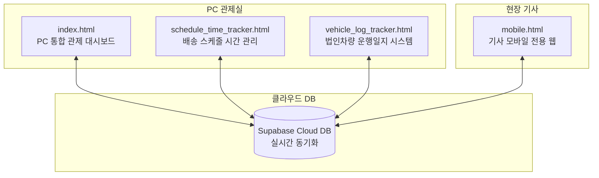
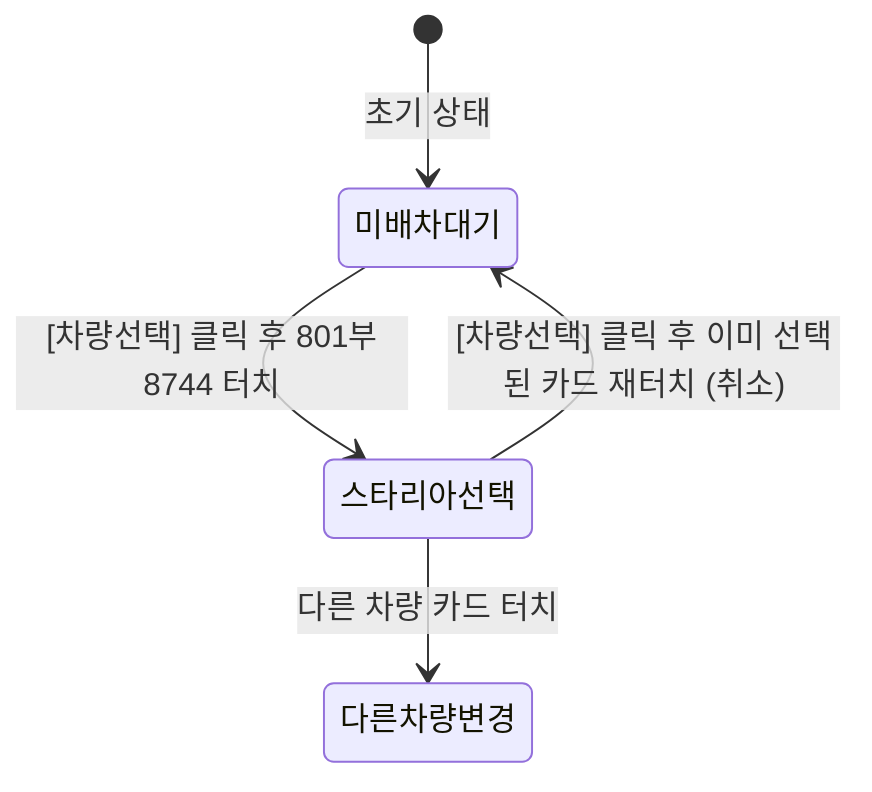
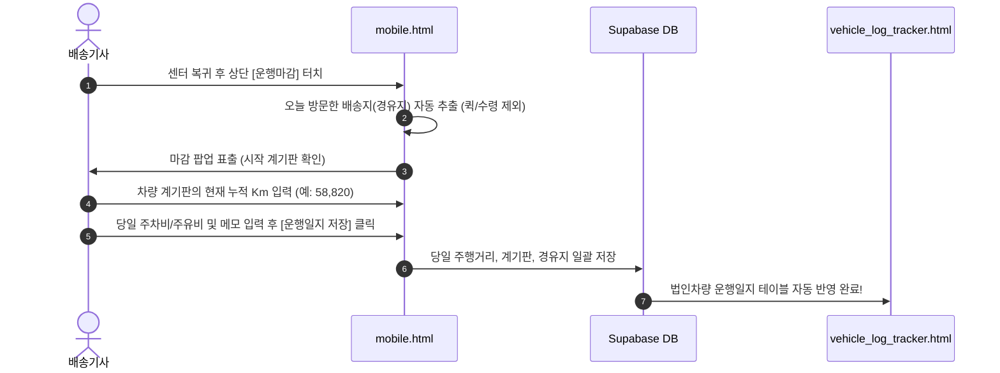
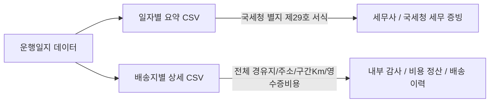

# 📘 현대렌탈 배송기사 모바일웹 & 법인차량 운행일지 통합 매뉴얼

본 매뉴얼은 현대렌탈의 **현장 배송기사용 모바일 웹**과 **법인차량 운행일지 관리 시스템**을 현업에서 원활하고 정확하게 사용하기 위한 표준 가이드라인입니다.

---

## 📑 목차
1. [시스템 구성 개요](#1-시스템-구성-개요)
2. [배송기사 모바일웹 사용 매뉴얼 (기사용)](#2-배송기사-모바일웹-사용-매뉴얼-기사용)
   - [2.1 스마트폰 홈 화면 바로가기(PWA) 추가](#21-스마트폰-홈-화면-바로가기pwa-추가)
   - [2.2 기사 로그인 및 본인 인증](#22-기사-로그인-및-본인-인증)
   - [2.3 법인차량 선택 및 취소 (토글)](#23-법인차량-선택-및-취소-토글)
   - [2.4 배송 순서 확인 및 변경 (▲/▼)](#24-배송-순서-확인-및-변경)
   - [2.5 배송 유형별 버튼 실행 가이드 (핵심!)](#25-배송-유형별-버튼-실행-가이드)
   - [2.6 고객 안심 통화 및 현장 사진/이슈 기록](#26-고객-안심-통화-및-현장-사진이슈-기록)
   - [2.7 하루 일과 마감 프로세스 (운행마감)](#27-하루-일과-마감-프로세스-운행마감)
3. [법인차량 운행일지 관리자 매뉴얼 (관리자/센터용)](#3-법인차량-운행일지-관리자-매뉴얼-관리자센터용)
   - [3.1 시스템 목적 및 법적 증빙 효력](#31-시스템-목적-및-법적-증빙-효력)
   - [3.2 대시보드 KPI 및 당일 운행 현황](#32-대시보드-kpi-및-당일-운행-현황)
   - [3.3 운행일지 직접 등록 및 수정 편집](#33-운행일지-직접-등록-및-수정-편집)
   - [3.4 경유지 추가·순서변경 및 카카오 경로 연동](#34-경유지-추가순서변경-및-카카오-경로-연동)
   - [3.5 국세청 법정 서식 및 상세 CSV 다운로드](#35-국세청-법정-서식-및-상세-csv-다운로드)
4. [1팀 / 2팀 법인차량 공유 운영 프로토콜](#4-1팀--2팀-법인차량-공유-운영-프로토콜)
5. [자주 묻는 질문 (FAQ)](#5-자주-묻는-질문-faq)

---

## 1. 시스템 구성 개요

현대렌탈 배송관리 시스템은 **클라우드(Supabase)**를 중심으로 모든 기기와 역할이 실시간으로 연결되어 있습니다.



- **배송기사 모바일웹 (`mobile.html`)**: 스마트폰 최적화 화면. 배송지 순서 확인, 티맵 내비 연동, 실시간 출발/도착 기록, 퀵/방문수령 처리, 사진 업로드, 당일 운행마감.
- **법인차량 운행일지 (`vehicle_log_tracker.html`)**: 모바일에서 마감된 차량 주행거리와 경유지를 집계하여 국세청 표준 양식 및 상세 세무 증빙으로 관리.

---

## 2. 배송기사 모바일웹 사용 매뉴얼 (기사용)

### 2.1 스마트폰 홈 화면 바로가기(PWA) 추가
기사님들이 매번 브라우저 주소를 입력하지 않고 **일반 스마트폰 앱처럼 바탕화면에서 원터치로 실행**할 수 있습니다.

1. 스마트폰 브라우저(크롬, 사파리, 삼성인터넷)로 모바일 웹 접속
2. 화면 상단의 **[바로가기]** 버튼 또는 배너 터치
   - **안드로이드**: 화면 하단에 뜨는 "홈 화면에 추가" 팝업에서 **[설치]** 터치
   - **아이폰(iOS)**: 사파리 하단 공유 버튼(네모+화살표) 터치 ➔ **[홈 화면에 추가]** 선택
3. 스마트폰 바탕화면에 **"현대렌탈배송"** 트럭 아이콘 앱이 생성됩니다.

---

### 2.2 기사 로그인 및 본인 인증
1. **이름 (아이디)**: 본인 성명 입력 (예: `김승지`, `조경찬`)
2. **비밀번호 (PIN)**: **숫자 4자리** 입력 (초기 비밀번호: `1234`)
3. **[자동 로그인]** 및 **[아이디 기억]** 체크 후 **[배송 업무 시작하기]** 터치
   > [!TIP]
   > [자동 로그인]을 체크해 두시면 다음부터 앱을 열 때 로그인 화면 없이 즉시 오늘 배송 화면으로 진입합니다.

---

### 2.3 법인차량 선택 및 취소 (토글)
출발 전, 오늘 본인이 직접 운전할 법인차량을 선택합니다.



1. **차량 선택**:
   - 상단 운행차량 영역의 **[차량선택]** 버튼 터치
   - 탑승할 차량(예: `801부8744 (스타리아)`) 카드를 터치하면 즉시 배차 완료
2. **차량 선택 취소 (해제)**:
   - 차량을 잘못 선택했거나, 차량 없이 배송을 인계받은 경우
   - [차량선택] 모달에서 **현재 선택되어 초록색 체크가 표시된 차량 카드를 한 번 더 누르면 선택이 취소**되고 '미배차 대기'로 복귀합니다.
3. **당일 운행자 교체**:
   - 센터 복귀 후 다른 기사가 해당 차량을 운행할 경우, 기존 기사는 [운행마감] 처리 후 다음 기사가 본인 모바일에서 해당 차량을 선택하면 됩니다.

---

### 2.4 배송 순서 확인 및 변경
실제 도로 상황, 고객 요청에 따라 방문 순서를 자유롭게 조정할 수 있습니다.

- **순서 위/아래 이동**: 각 배송 카드 우측 상단의 **[▲] / [▼]** 버튼을 터치하여 원하는 순서로 즉시 변경
- **실시간 관제 연동**: 순서를 바꾸는 즉시 관제 센터 PC 화면 및 지도에 실시간 반영
- **🗺️ 전체 배송 지도 보기**: 상단 파란색 버튼을 누르면 오늘 방문할 전체 경유지와 추천 주행 경로를 한눈에 볼 수 있습니다.

---

### 2.5 배송 유형별 버튼 실행 가이드 (핵심!)

현대렌탈의 배송은 3가지 유형으로 자동 분류되어 전용 버튼이 나타납니다.

| 배송 유형 | 좌측 버튼 | 우측 버튼 | 특징 및 안내 |
| :--- | :--- | :--- | :--- |
| **🚚 일반 직배송**<br>(기사 직접 운전) | **[티맵 안내]**<br>*(로즈레드)* | **[배송지 도착]**<br>*(에메랄드)* | - `[티맵 안내]` 클릭 시 **출발 시각 자동 기록 & 스마트폰 티맵 앱 즉시 실행**<br>- 배송지 도착 후 `[도착 완료]` 클릭 시 이동 소요시간 자동 계산 |
| **⚡ 퀵 배송**<br>(오토바이 외주) | **[접수완료]**<br>*(보라색)* | **[퀵 출발]**<br>*(남색)* | - 퀵 기사 접수 시 `[접수완료]` 클릭 ➔ 접수 시각 기록<br>- 퀵 기사가 물품 픽업 후 출발 시 `[퀵 출발]` 클릭 ➔ 출발 시각 기록<br>- **법인차량 운행일지에서 자동 제외** (국세청 증빙 왜곡 방지) |
| **🏢 방문수령**<br>(고객 내방) | *(티맵 불필요 - 완전 숨김)* | **[수령 완료 처리]**<br>*(에메랄드 8열 전폭)* | - 고객 센터 방문 시 `[수령 완료 처리]` 원클릭<br>- 오조작 방지를 위해 길안내 버튼 배제 및 큼직한 단독 버튼 제공 |

> [!IMPORTANT]
> **직배송 건 출발 시 필수 행동**:
> 이동 전 반드시 **[티맵 안내]** 버튼을 눌러 출발하십시오. 버튼을 누르면 관제 센터에 기사님의 출발 시각이 자동 전송되며 티맵 내비게이션이 자동으로 켜집니다.

---

### 2.6 고객 안심 통화 및 현장 사진/이슈 기록
- **고객 전화 통화**: 고객 카드 내 **[초록색 전화 버튼]** 터치 ➔ 오발신 방지 확인 팝업 후 바로 스마트폰 통화 화면 연결
- **현장 사진 첨부**:
  - `[📷 현장 사진 촬영/첨부]` 터치 ➔ 문 앞 배송 사진 또는 설치 완료 사진 등록
  - 이미지는 폰 데이터 절약을 위해 **자동 압축(최적화)**되어 클라우드에 안전하게 저장됩니다.
- **특이사항 메모**: 부재중 요청사항, 보관 장소 등을 입력하고 `[저장]` 터치

---

### 2.7 하루 일과 마감 프로세스 (운행마감)

오늘의 모든 배송을 마치고 센터로 복귀한 후 **단 1분 만에 차량 운행일지를 자동 마감**합니다.



1. 센터 복귀 후 상단 운행차량 카드 우측의 **[운행마감]** (초록색 깃발 아이콘) 터치
2. **도착지 확인**: 기본값 `가산 센터 (복귀)` 확인 (자택 퇴근 시 도착지 변경 가능)
3. **종료 계기판 입력**: 차량 계기판에 표시된 현재 최종 누적 Km 입력 (오늘 실주행거리 자동 계산)
4. **비용 입력 (선택)**: 오늘 발생한 주차비 총액, 주유비 총액 입력
5. **[오늘 운행일지 저장 및 마감]** 터치 ➔ **오늘의 배송 및 차량 일지 작성 완료!**

---

## 3. 법인차량 운행일지 관리자 매뉴얼 (관리자/센터용)

### 3.1 시스템 목적 및 법적 증빙 효력
- **법적 근거**: 소득세법 및 법인세법에 따른 **국세청 업무용 승용차 운행기록부(별지 제29호 서식)** 100% 호환
- **특징**: 수기 장부 작성 없이 모바일 웹 마감 데이터와 카카오 모빌리티 도로망 거리를 연동하여 전산화

---

### 3.2 대시보드 KPI 및 당일 운행 현황
화면 상단에서 차량별 월간 핵심 지표를 실시간 확인합니다:
- **전월말 계기판**: 해당 월 1일 시작 시점의 차량 누적 계기판 Km
- **당월말 계기판**: 현재까지 주행한 최종 누적 계기판 Km
- **총 주행거리 / 운행일수**: 이번 달 총 운행 거리 및 가동 일수
- **업무용 사용 비율**: 100% (회사 공식 업무 및 배송 목적)
- **당일 실시간 운행 현황**: 오늘 현재 배송 중인 차량 번호 및 마지막 도착지 실시간 표출

---

### 3.3 운행일지 직접 등록 및 수정 편집
기사가 모바일로 마감하지 못했거나 관리자가 수동으로 일지를 입력/보정해야 할 때 사용합니다.

1. **직접 등록**: 상단 **[+ 운행일지 직접 등록]** 클릭
2. **운전자 선택**:
   - 담당 기사 8인 명단 지원: `강동우`, `김승지`, `조경찬`, `이성호`, `장종순`, `박종환`, `현민혁`, `기타`
   - **1팀 업무 운행 건**: 운전자를 **`기타`**로 지정
3. **계기판 입력**: 시작 Km와 종료 Km를 입력하면 주행거리가 자동 산출됩니다.
4. **화면 편의성**: 등록/수정 모달에 반응형 스크롤(`max-h-[90vh]`)이 적용되어 모니터 크기와 무관하게 버튼이 가려지지 않고 쾌적하게 조작 가능합니다.

---

### 3.4 경유지 추가·순서변경 및 카카오 경로 연동
중간에 경로가 변경되었거나 추가 경유지(1팀 업무, 주유소 등)가 발생한 경우:

- **경유지 추가**: [＋ 1팀 업무 경유지], [＋ 주유소], [＋ 일반 경유지] 버튼 클릭 ➔ 주소 입력
- **순서 변경**: 경유지 목록 우측의 **[▲] / [▼]** 버튼 클릭으로 순서 재정렬
- **삭제**: 필요 없는 경유지 우측 [휴지통] 클릭
- **거리 자동 재계산**: 경유지 순서를 바꾸면 카카오 지도 API가 실제 주행 도로 추천 거리를 즉시 재계산하여 계기판 오차를 검증합니다.

---

### 3.5 국세청 법정 서식 및 상세 CSV 다운로드
화면 우측 상단의 **[CSV 다운로드]** 드롭다운 버튼을 통해 용도별 엑셀(CSV) 파일을 내려받습니다.



1. **일자별 요약 CSV (국세청 표준)**:
   - 일자, 차량번호, 사용자, 주행 전 계기판, 주행 후 계기판, 주행거리, 업무용 사용거리, 부대비용 등
   - **용도**: 연말정산 및 법인세 신고 시 세무서 제출용
2. **배송지별 상세 CSV (감사용 - 추천)**:
   - 각 날짜의 **모든 경유지명, 도로명 주소, 도착 시간, 구간별 계기판 Km, 개별 주차비/주유비**까지 모두 수록
   - **용도**: 회사 내부 감사, 주행거리 실사, 영수증 실비 정산 증빙용

---

## 4. 1팀 / 2팀 법인차량 공유 운영 프로토콜

현대렌탈은 1팀과 2팀이 법인차량(스타리아 등)을 함께 공유하여 운영합니다. 아래 수칙을 준수하면 계기판 충돌 없이 완벽히 운영됩니다.

> [!IMPORTANT]
> **차량 공유 3대 골든 룰**:
> 1. **인계 시 마감 필수**: 오전 운행 기사가 센터로 복귀하면 반드시 모바일에서 **[운행마감]**을 눌러 최종 계기판을 확정 짓습니다.
> 2. **인수 시 계기판 확인**: 다음 탑승자(오후 기사 또는 1팀)는 탑승 전 차량 계기판의 숫자가 모바일의 시작 계기판과 일치하는지 확인합니다.
> 3. **1팀 운행 건 표기**: 1팀이 차량을 사용한 내역은 운행일지에서 담당자를 **`기타`**로 기재하고 경유지명에 `[1팀] 업무명`으로 저장합니다.

### 시나리오 예시
```
[오전 08:30 ~ 13:00] 2팀 기사 배송 운행 (계기판: 50,000 km ➔ 50,060 km)
  ➔ 센터 복귀 후 기사 모바일에서 [운행마감] 클릭 (종료: 50,060 km 확정)

[오후 13:30 ~ 17:00] 1팀 직원 외부 업무 운행 (계기판: 50,060 km ➔ 50,110 km)
  ➔ 센터 복귀 후 운행일지에서 [운행일지 직접 등록] (운전자: 기타 / 시작: 50,060 / 종료: 50,110)

[익일 08:30] 2팀 기사 출근 시 모바일 시작 계기판이 50,110 km로 자동 승계됨!
```

---

## 5. 자주 묻는 질문 (FAQ)

**Q1. 당일 배송 중 추가 건이 생겨 관리자가 CSV를 다시 업로드했는데, 기사가 기록했던 출발/도착 시간이 지워지나요?**
> **A. 절대 지워지지 않습니다.** 시스템에 '시간 보존 병합 엔진'이 구축되어 있어, CSV를 덮어씌우더라도 기사님이 이미 기록한 출발 시간(`depart_time`), 도착 시간(`arrive_time`), 현장 사진, 메모는 100% 안전하게 보존됩니다.

**Q2. 퀵 배송 건을 처리했는데 왜 법인차량 운행일지 경유지에 안 나오나요?**
> **A. 정상적인 동작입니다.** 퀵 배송은 법인차량을 운행한 것이 아니라 외주 퀵 기사가 배송한 건이므로, 법인차량 운행일지에 들어가면 국세청 세무 증빙상 허위 주행거리가 됩니다. 따라서 시스템이 자동으로 퀵 배송과 방문수령 건을 제외하고 실제 차량 주행 건만 집계합니다.

**Q3. 차량을 잘못 선택했는데 취소가 안 되나요?**
> **A. 취소 가능합니다.** 상단 [차량선택] 버튼을 누른 후, 현재 선택된 차량 카드를 **한 번 더 누르면 선택이 취소**되어 미배차 상태로 돌아갑니다.

**Q4. 센터 복귀가 아니라 집으로 바로 퇴근(현지 퇴근)할 때는 어떻게 마감하나요?**
> **A.** 모바일 [운행마감] 팝업에서 도착지 우측의 **[도착지 변경]**을 눌러 '자택' 또는 현지 주소를 입력하면 해당 위치까지의 거리로 안전하게 마감됩니다.

**Q5. 모바일 웹에서 글자나 버튼이 너무 작거나 크게 보입니다.**
> **A.** 스마트폰 브라우저 설정에서 '텍스트 크기'를 100% 기본값으로 설정해 주시고, 상단 [바로가기]를 통해 홈 화면에 앱으로 추가하여 실행하시면 전체화면으로 가장 쾌적하게 이용하실 수 있습니다.
