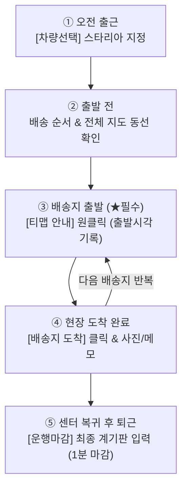

# 📘 현대렌탈 배송관제 & 법인차량 운행일지 통합 실무 매뉴얼 (v2.6)

본 매뉴얼은 현대렌탈의 **기사 모바일웹 (`mobile.html`)**, **PC 통합 관제 대시보드 (`index.html`)**, **법인차량 운행일지 (`vehicle_log_tracker.html`)**에 대한 실무 운영 표준 지침서입니다.

---

## 📑 목차
1. [1. 배송기사 스마트폰 모바일웹 실무 가이드](#1-배송기사-스마트폰-모바일웹-실무-가이드)
   - 1.1 바탕화면 앱(PWA) 1초 설치 & 4자리 PIN 로그인
   - 1.2 ★ 기사 하루 업무 전체 프로세스 & 1분 운행마감 (필독)
   - 1.3 법인차량 선택 및 재터치 취소(토글) 상세
2. [2. PC 관제 대시보드 업무 프로세스 (관리자)](#2-pc-관제-대시보드-업무-프로세스-관리자)
   - 2.1 대시보드 화면 구성 및 핵심 메뉴 번호 안내
   - 2.2 관리자 당일 배송관제 6단계 업무 진행 순서
   - 2.3 ⚡ 퀵 배송 & 🏢 방문수령 관리자 분기 관제
3. [3. 법인차량 운행일지 시스템 & 1·2팀 차량 공유](#3-법인차량-운행일지-시스템--12팀-차량-공유)
   - 3.1 일반 직배송과 법인차량 운행일지 자동 연동 원리
   - 3.2 1팀 / 2팀 법인차량 공유 3대 골든 룰 & 운영 프로토콜
   - 3.3 운행일지 시스템 화면 기능 & 운전자 직접입력 가이드 (한민혁 포함 8인)
   - 3.4 국세청 표준 CSV & 배송지별 상세 CSV 다운로드

---

## 1. 배송기사 스마트폰 모바일웹 실무 가이드

### 1.1 바탕화면 앱(PWA) 1초 설치 & 4자리 PIN 로그인
1. **바탕화면 앱 설치**:
   - 스마트폰 브라우저로 모바일웹 접속 ➔ 상단 노란색 **[바로가기]** 터치
   - 안드로이드: **[홈 화면에 추가]** / 아이폰: 사파리 공유창 ➔ **[홈 화면에 추가]**
   - 바탕화면에 **"현대렌탈배송"** 트럭 아이콘 앱이 생성되어 1터치로 즉시 실행됩니다.
2. **숫자 4자리 PIN 로그인**:
   - **이름**: 본인 성명 입력 (예: `김승지`, `조경찬`)
   - **비밀번호**: 숫자 4자리 PIN (초기 공통 비밀번호: `1234`)
   - **[자동 로그인] 체크**: 다음 접속 시 로그인창 없이 오늘 배송 화면으로 바로 진입합니다.

---

### 1.2 ★ 기사 하루 업무 전체 프로세스 & 1분 운행마감 (필독)



#### Step ① [출근 및 법인차량 선택]
- 상단 **[차량선택]** 버튼 터치 ➔ 탑승할 스타리아(예: `801부8744`) 선택
- 이전 운행자(1팀 또는 기사)가 마감한 최종 계기판 Km가 내 **시작 계기판**으로 자동 승계됩니다.
- *차량을 잘못 선택했거나 배차를 취소할 때*: [차량선택] 모달에서 현재 선택된 초록색 체크 카드를 **한 번 더 누르면 선택이 취소**되어 미배차 대기 상태로 복귀합니다.

#### Step ② [배송 순서 및 전체 지도 동선 확인]
- 오늘 나에게 배정된 배송지 목록을 확인합니다.
- 상단 **[🗺️ 전체 배송 지도 보기 & 실제 주행 경로]**로 오늘 추천 도로 주행선을 확인합니다.
- 현장 도로 상황에 맞춰 카드의 **[▲] / [▼]** 버튼으로 방문 순서를 즉시 바꿀 수 있습니다.

#### Step ③ [배송지 출발: [티맵 안내] 원클릭 실행] (★ 기사 필수 준수사항)
> [!IMPORTANT]
> **출발 전 필수 행동**:
> 배송지로 출발할 때는 스마트폰 티맵 앱을 따로 켜지 마시고, 반드시 모바일웹의 로즈레드 색상 **`[티맵 안내]`** 버튼을 터치하여 출발하십시오!
> - **버튼 터치 즉시**: 관제 대시보드와 시간 관리 시스템에 기사님의 **출발 시각이 초 단위로 자동 전송**됩니다.
> - **내비게이션 자동 실행**: 고객사 도로명 주소가 티맵 내비 목적지로 자동 입력되어 즉시 길안내가 시작됩니다.

#### Step ④ [배송지 도착 완료 처리 & 사진/메모 기록]
- 고객사 현장에 도착하면 즉시 **`[배송지 도착 / 도착 완료]`** 버튼을 누릅니다.
- 출발 시각부터 도착 시각까지의 주행 소요시간(예: 35분 소요)이 시스템에 자동 기록됩니다.
- 부재중 문 앞 보관 또는 설치 완료 사진은 `[📷 사진 첨부]`로 등록 시 자동 압축되어 클라우드에 안전 저장됩니다.

#### Step ⑤ [센터 복귀 후 1분 운행마감]
- 모든 배송을 마치고 가산 센터로 복귀하면 상단 운행차량 카드 우측의 **`[운행마감]`** (초록 깃발) 버튼을 터치합니다.
- **1. 종료 계기판 입력**: 차량 계기판의 현재 최종 누적 Km 입력 ➔ 오늘 실주행거리 자동 계산
- **2. 비용 입력 (선택)**: 주차비, 주유비 영수증 금액과 특이사항 메모 입력
- **3. [오늘 운행일지 저장 및 마감]** 터치 ➔ 법인차량 운행일지 시스템으로 자동 전송되며 오늘 일과 종료!

---

### 1.3 법인차량 선택 및 재터치 취소(토글) 상세
- **차량 선택**: 상단 [차량선택] 클릭 ➔ 본인 차량 카드 클릭 ➔ 시작 계기판 자동 로드.
- **선택 취소 (토글)**: 차량을 잘못 선택했거나 미배차 상태로 돌릴 때, 이미 체크된 카드를 **한 번 더 터치**하면 배차가 즉시 해제됩니다.

---

## 2. PC 관제 대시보드 업무 프로세스 (관리자)

### 2.1 대시보드 화면 구성 및 핵심 메뉴 번호 안내
```
┌──────────────────────────────────────────────────────────────────────────────────────────┐
│ [① 날짜선택]  [② 기사필터]  [③ CSV 등록]  [④ +직접추가]  [⑤ 차량일지]  [⑥ 배정알림] [⑦ 이력] [⑧ 팝업메뉴]│
├──────────────────────────────────────────────────────────────────────────────────────────┤
│ 🗺️ 카카오 지도 영역 (실시간 도로 경로 표시) │ 📋 배송 스케줄 메인 테이블 (드래그앤드롭 순서변경)│
└──────────────────────────────────────────────────────────────────────────────────────────┘
```
- **① 날짜 선택 캘린더**: 당일 및 과거/미래 배송 스케줄 전환
- **② 기사 필터**: 전체 기사 보기 또는 개별 기사별 필터링
- **③ `[CSV 등록]`**: 아침 배송 스케줄 일괄 업로드 (시간 보존 병합 탑재)
- **④ `[+ 직접 추가]`**: 당일 긴급 수기 주문 실시간 등록
- **⑤ `[차량 일지]`**: 법인차량 운행일지 시스템 바로가기
- **⑥ `[배정 알림]`**: 기사 카카오톡/문자 일정 전송
- **⑦ `[이력 조회]`**: 계약번호별 과거 배송/회수/메모 이력 조회
- **⑧ 우측 상단 팝업 메뉴**: `📖 시스템 통합 매뉴얼 (웹/PDF)`, 배송 스케줄 시간 관리, 관리자 설정

---

### 2.2 관리자 당일 배송관제 6단계 업무 진행 순서

1. **Step 1: 아침 배송 스케줄 CSV 등록 & '시간 보존 병합'**:
   - ERP 엑셀 CSV 파일을 `[CSV 등록]` 버튼으로 업로드합니다.
   - **시간 보존 병합**: 낮에 추가 건으로 인해 CSV를 다시 덮어씌워도 기사가 이미 기록한 출발/도착 시각, 사진, 메모는 100% 영구 보존됩니다.
2. **Step 2: 기사별 배정 & 거점(출발지) 확인**:
   - 메인 테이블에서 각 주문의 담당기사를 지정합니다.
   - 개별 거점에서 출발하는 기사는 우측 상단 메뉴의 [기사별 출발지/거점 관리]에서 주소를 설정합니다.
3. **Step 3: 배송 방식 분기 관제 (퀵 배송 & 방문수령)**:
   - 외주 퀵과 고객 내방 건을 일반 직배송과 분리하여 정확히 처리합니다. (상세 아래 2.3 참조)
4. **Step 4: 카카오 도로 경로 계산 & 드래그앤드롭 순서 최적화**:
   - `[🔄 실제 도로 경로 계산]` 버튼으로 실시간 교통이 반영된 도로 경로와 거리(Km)/시간 산출
   - 마우스 드래그앤드롭 또는 [▲]/[▼] 버튼으로 순서 정렬 ➔ 기사 모바일 즉시 동기화
5. **Step 5: 기사 배정 알림 전송 (카카오톡/SMS)**:
   - `[배정 알림]` 버튼으로 기사 스마트폰에 오늘 일정 일괄 발송
6. **Step 6: 실시간 관제 & 시간 관리 타임트래커 모니터링**:
   - 메인 테이블 및 모바일 관리자 카드에서 실시간 운행/도착 모니터링
   - `[배송 스케줄 시간 관리]`에서 기사별 출발/도착 타임라인 점검

---

### 2.3 ⚡ 퀵 배송 & 🏢 방문수령 관리자 분기 관제

| 배송 구분 | 관리자 조작 버튼 | 처리 절차 및 세무 무결성 |
| :--- | :--- | :--- |
| **⚡ 퀵 배송**<br>(오토바이 외주) | **`[접수완료]`** (보라색)<br>➔ **`[퀵 출발]`** (남색) | 1. 퀵 접수 완료 시: `[접수완료]` 클릭 ➔ 접수시각 기록<br>2. 퀵 기사 픽업 시: `[퀵 출발]` 클릭 ➔ 출발시각 기록<br>* 법인차량 운행이 아니므로 **운행일지에서 자동 제외**되어 세무 증빙 무결성 유지 |
| **🏢 방문수령**<br>(고객 내방) | **`[수령 완료]`** (에메랄드 단독) | 1. 내비 불필요: 티맵 버튼 완전 제거<br>2. 고객 방문 인도 시: `[수령 완료]` 클릭 ➔ 완료 처리 |

---

## 3. 법인차량 운행일지 시스템 & 1·2팀 차량 공유

### 3.1 일반 직배송과 법인차량 운행일지 자동 연동 원리
- **직배송은 차량 운행**: 기사가 모바일에서 직배송 건의 [티맵 안내]와 [도착 완료]를 누르면, 방문 업체의 도로명 주소와 도착 시각이 당일 법인차량의 **공식 경유지**로 자동 기록됩니다.
- **운행마감 결합**: 센터 복귀 후 기사가 모바일에서 [운행마감]을 누르면, 모든 경유지와 최종 계기판 Km가 결합되어 **국세청 업무용 승용차 운행기록부**로 자동 완성됩니다.

---

### 3.2 1팀 / 2팀 법인차량 공유 3대 골든 룰 & 운영 프로토콜
현대렌탈은 1팀과 2팀이 법인차량(스타리아)을 함께 공유합니다.

> [!IMPORTANT]
> **차량 공유 3대 골든 룰**:
> 1. **인계 시 마감 필수**: 오전 운행자(2팀 기사)는 센터 복귀 즉시 모바일에서 **`[운행마감]`**을 눌러 최종 계기판을 확정합니다.
> 2. **인수 시 계기판 대조**: 다음 탑승자(1팀 또는 오후 기사)는 실제 계기판 숫자와 화면 시작 계기판 숫자가 일치하는지 확인합니다.
> 3. **1팀 운행은 '기타' 표기**: 1팀 직원이 외부 업무로 운행한 경우 운전자를 **`기타`**로 지정하고 성명을 직접 입력하여 사용 내역을 구분합니다.

#### 실제 차량 공유 시나리오:
- **오전 (2팀 배송)**: 50,000 km ➔ 50,060 km (모바일웹에서 [운행마감] 완료)
- **오후 (1팀 업무)**: 50,060 km로 인수 ➔ 50,110 km 운행 후 [운행일지 직접 등록] (운전자: 기타 / 직접입력)
- **익일 아침**: 2팀 기사 출근 시 모바일 시작 계기판이 50,110 km로 자동 승계되어 오차가 0km로 유지됩니다.

---

### 3.3 운행일지 시스템 화면 기능 & 운전자 직접입력 가이드
- **등록 운전자 명단**:
  - `강동우, 김승지, 조경찬, 이성호, 장종순, 박종환, 한민혁`
- **명단 외 인원 및 1팀 직원 처리**:
  - 운전자 선택에서 **`기타`**를 선택한 후, **실제 운전자 성명을 직접 입력**하여 저장합니다.
- **경유지 순서 편집 & 90vh 반응형 스크롤**:
  - [▲]/[▼] 버튼으로 순서를 바꾸거나, 주유소 및 1팀 업무 경유지를 자유롭게 추가·삭제할 수 있습니다. (카카오 지도 도로거리 자동 재계산)
  - 90vh 반응형 스크롤이 적용되어 모니터 크기와 무관하게 하단 저장 버튼이 잘리지 않습니다.

---

### 3.4 국세청 표준 CSV & 배송지별 상세 CSV 다운로드
우측 상단 **[CSV 다운로드]** 버튼을 통해 목적에 맞는 2가지 서식으로 내려받습니다:
1. **배송지별 상세 CSV (추천)**: 모든 경유지명, 도로명 주소, 도착 시간, 구간별 계기판 Km, 영수증 주차비/주유비 수록 (내부 감사 및 실비 정산용)
2. **일자별 요약 CSV (국세청 표준)**: 국세청 법인세 신고용 표준 서식(별지 제29호) 호환본 (세무서 제출용)
